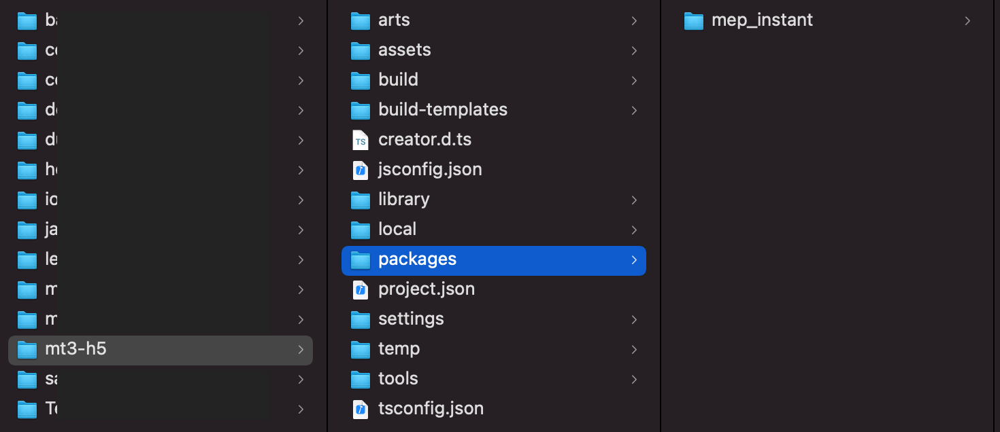
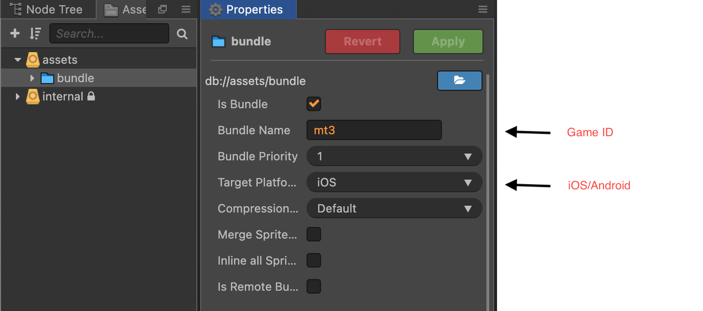
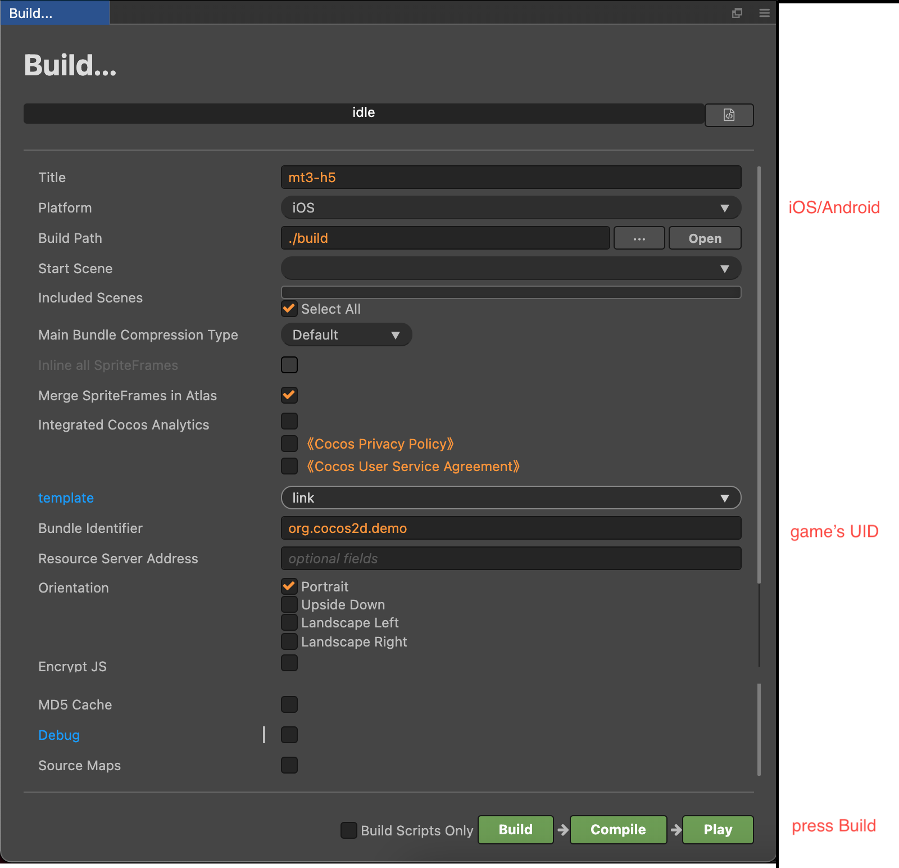

# MEPIntant
> Amanotes's mep_instant SDK DOC

---------------------------------------------------------

# MEPIntant SDK

| Version | Changelog | Doc | Link | Cocos extension |
| ----------- | ----------- | ----------- | ----------- | ----------- | 
| 2.5.0 | <ul><li>Fix current time precision </li><li>Save game support</li></ul> | [Doc](docs_2_5_0/DOCS.md) | [UNPKG](https://unpkg.com/@mep.tech/instant@2.5.0/dist/mepinstant.umd.production.min.js) | [ZIP](https://d1wkdokb986dq4.cloudfront.net/mep-instant-sdk/mep_instant_2.3.0-alpha8.zip)
| 2.5.1 | <ul><li>Fix current time precision </li><li>Save game support</li></ul> | [Doc](docs_2_5_1/DOCS.md) | [UNPKG](https://unpkg.com/@mep.tech/instant@2.5.1/dist/mepinstant.umd.production.min.js) | [ZIP](https://d1wkdokb986dq4.cloudfront.net/mep-instant-sdk/mep_instant_2.3.0-alpha8.zip)

# How to enable Native-like game

## Prerequisite
- Cocos Creator version 2.4.4
- Programming language: Typescript.
- mep_instant’s cocos extension: 
  - [Cocos's guideline](https://docs.cocos.com/creator/manual/en/extension/install-and-share.html#project-packages)
  - [mep_instant cocos creator](#mepintant-sdk)
- Game bundling: [cocos’s guideline](https://docs.cocos.com/creator/manual/en/scripting/asset-bundle.html)
- SandboxApp testflight version 2.0.0 - 202104081641
- Bundle size limit: 5MB
## Unsupported
- cookie
- DOM
- NodeJS 
## Sample steps to test with SandBox app
> Sample Game: Magic Tiles 3  
> Sample Game ID: mt3

- install [mep_instant’s cocos extension](#prerequisite) in project

- [Bundling project](#prerequisite)

- Export bundle

- Testing

